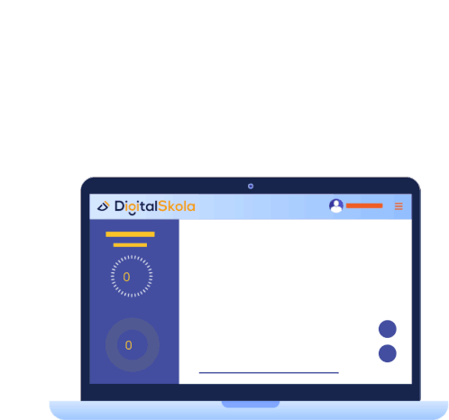
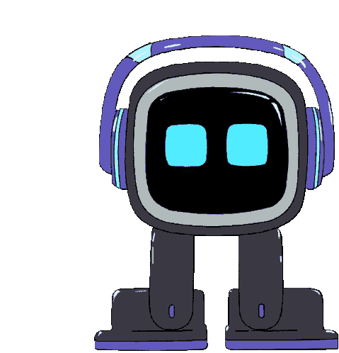

<h2> Hello, I'm Dennis  </h2>

-------------------

<p><em>I’m interested in: 
<div>
  <ul>
    <li>Data Science </li>
    <li>Machine Learning </li>
    <li>Artificial Intelligence </li>
    <li>Music </li>
  </ul>
</div>
</em>
</p>
<p> 

```typescript
class Engineer {
name = 'Dennis';
lastname = 'López';
hobbies = 'Reading', 
          'Listening to music', 
          'Playing musical instruments', 
          'Drawing';
languages = ['C', 'C++', 'Python'];
coding() {}
reading() {}
learning() {}
private compositing_music() {}
}
```

</p>

---------------------------------

<p>
Currently I’m learning Python for Data Science  </p>

---------------------------

<div>
  <em>"I really enjoy meeting new people, so let's connect!" 
    <p>  </em> </p>
</div>
